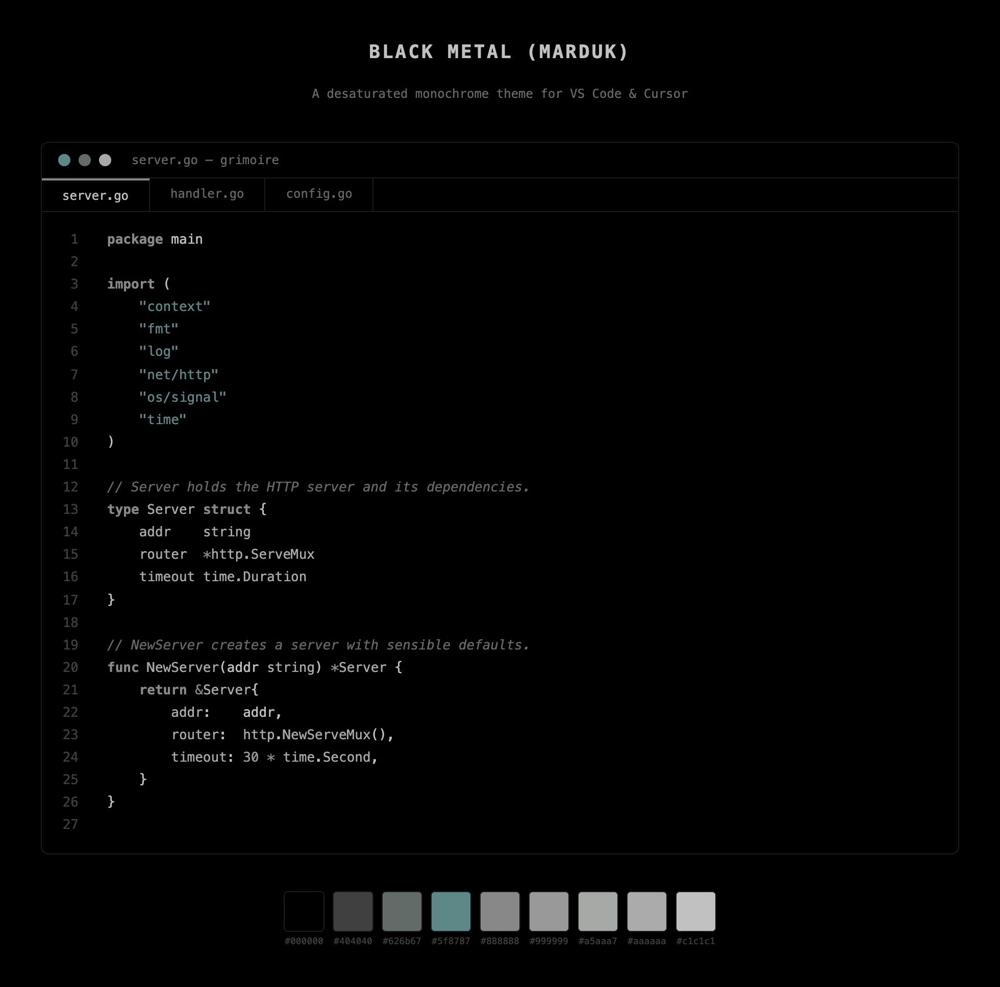
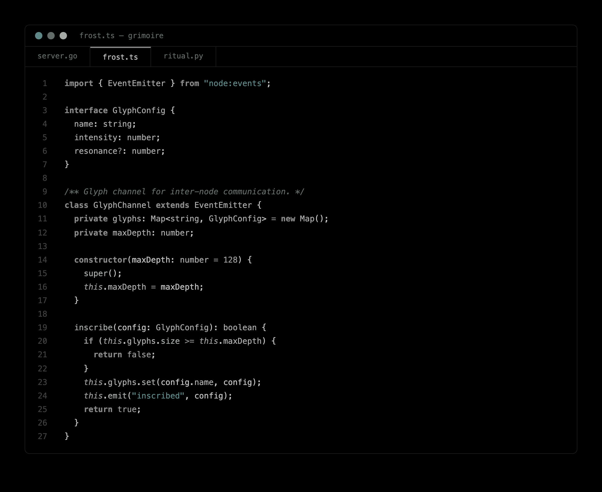
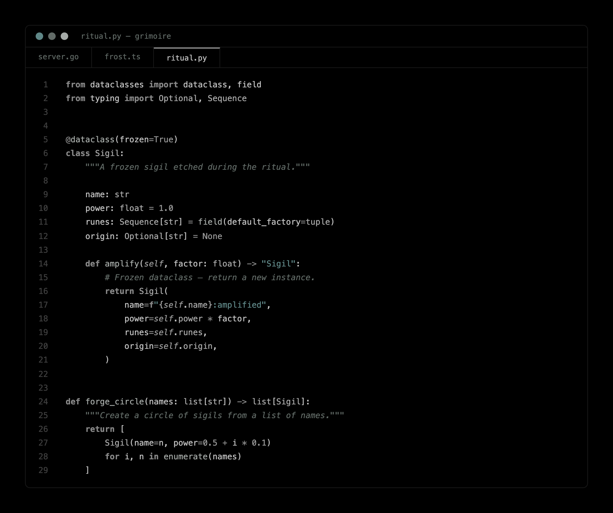

# Black Metal (Marduk)

[](https://marketplace.visualstudio.com/items?itemName=v0id-user.black-metal-marduk)
[](https://marketplace.visualstudio.com/items?itemName=v0id-user.black-metal-marduk)
[](LICENSE)

A desaturated monochrome color theme for **VS Code** and **Cursor**, inspired by the cold, washed-out aesthetic of black metal album art.

Pure black background. Muted grays. A single faded teal for strings. No noise, no neon, no distractions — just code on stone.



## Palette

| Role           | Hex       |
|----------------|-----------|
| Background     | `#000000` |
| Foreground     | `#c1c1c1` |
| Bright black   | `#404040` |
| Red (strings)  | `#5f8787` |
| Green (funcs)  | `#a5aaa7` |
| Yellow (cmts)  | `#626b67` |
| Blue (kwords)  | `#888888` |
| Magenta (nums) | `#999999` |
| Cyan (types)   | `#aaaaaa` |
| White          | `#c1c1c1` |

## Syntax mapping

- **Strings & regex** — `#5f8787` (the only hint of color)
- **Functions** — `#a5aaa7`
- **Comments** — `#626b67`, italic
- **Keywords** — `#888888`, bold
- **Numbers, constants, `this`/`self`** — `#999999`
- **Types, classes, properties, links** — `#aaaaaa`
- **Variables, punctuation, default text** — `#c1c1c1`
- **Line numbers, borders, gutters** — `#404040`

Terminal ANSI colors match the palette exactly, so your shell stays consistent with your editor.

## More screenshots





## Install

### From the VS Code Marketplace

Search **"Black Metal Marduk"** in the Extensions panel, or install from the CLI:

```bash
# VS Code
code --install-extension v0id-user.black-metal-marduk

# Cursor
cursor --install-extension v0id-user.black-metal-marduk
```

Or open it directly: [marketplace.visualstudio.com/items?itemName=v0id-user.black-metal-marduk](https://marketplace.visualstudio.com/items?itemName=v0id-user.black-metal-marduk)

### From a release `.vsix`

1. Download the latest `.vsix` from the [Releases page](https://github.com/v0id-user/vscode-black-metal-marduk/releases).
2. Install it:

   ```bash
   # VS Code
   code --install-extension black-metal-marduk-0.0.3.vsix

   # Cursor
   cursor --install-extension black-metal-marduk-0.0.3.vsix
   ```

### Build from source

```bash
git clone https://github.com/v0id-user/vscode-black-metal-marduk.git
cd vscode-black-metal-marduk
npx @vscode/vsce package --no-dependencies --allow-missing-repository
code --install-extension black-metal-marduk-*.vsix   # or: cursor --install-extension ...
```

## Activate

1. Reload your editor: `Cmd+Shift+P` → **Developer: Reload Window**
2. Open the theme picker: `Cmd+K Cmd+T` (or `Cmd+Shift+P` → **Preferences: Color Theme**)
3. Select **Black Metal (Marduk)**

## Recommended pairings

For maximum effect:

- **Font:** any monospace with character — Berkeley Mono, JetBrains Mono, Iosevka, Commit Mono
- **Window:** hide the activity bar (`workbench.activityBar.location: hidden`) and breadcrumbs (`breadcrumbs.enabled: false`) for a true monolith
- **Terminal:** the ANSI colors are wired in — no extra config needed

## Contributing

Found a syntax scope that looks off? Open an issue or PR.

## License

[MIT](LICENSE) — do whatever you want with it.

---

> *"The pen is mightier than the sword — and the editor mightier still."*
